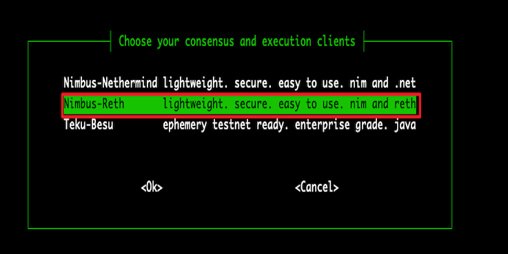
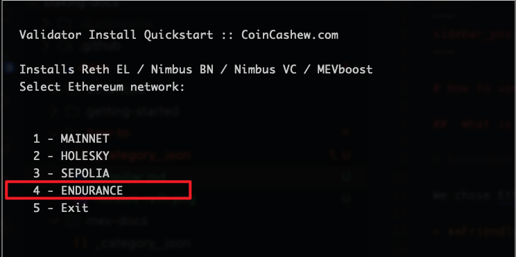

# How to use Ethpillar setup validator for Endurance staking

##  What is EthPillar?

> Empowered, inspired, home staker. Free. Open source. Public goods for Ethereum. ARM64 and AMD64 support.

We chose EthPillar to simplify the onboarding process for new users to become solo stakers due to the following reasons:

- **Friendly Node Installer**: Helps you deploy a systemd installation with minority clients `Nimbus-Reth` in just minutes. MEVboost included.

- **Ease of use**: No more remembering CLI commands required. Access common node operations via a simple text user interface (TUI).

- **Fast Updates**: Quickly find and download the latest consensus/execution release. Less downtime!


## Installation

```sh
/bin/bash -c "$(curl -fsSL https://raw.githubusercontent.com/OpenFusionist/EthPillar-Endurance/main/install.sh)"
```


## Running nodes

```sh
ethpillar
```

The complete process can be confirmed step by step according to the ethpillar tips. Ethpillar TUI provides detailed instructions, and we have also recorded a video for user reference. TODO: add video link

Below are some screenshots of key step selections:

- Choose Nimbus-Reth client(4 CPU+8G memory)




- Choose Endurance network



- Choose solo-staking mode


## Generate validator key && Send Deposit 

ethpillar integrates [ethstaker-deposit-cli](https://github.com/OpenFusionist/ethstaker-deposit-cli) to facilitate user management of Validators within the TUI, including generating and importing Validator keys, and making deposits.


just run `ethpillar` select `Validator Client->Generate / Import Validator Keys` and follow the instructions.

ethpillar will automatically load the generated keys into the validator.

Following the TUI prompts, you can choose to send your deposit request on-chain via [launchpad](https://staking.fusionist.io) (for most users).

We also provide a batch sending [tool](https://github.com/OpenFusionist/staking-batch-depositer) for users who need to run multiple keys simultaneously (for advanced users).


## Withdraw Deposit

ethpillar integrates [ethdo](https://github.com/wealdtech/ethdo) to facilitate user management of Validators withdraw within the TUI

just run `ethpillar` select `Validator Client->Generate Voluntary Exit Messages (VEM)` and `Validator Client->Broadcast Voluntary Exit Messages (VEM)` and follow the instructions.

:::note
ethpillar will withdraw all keys in your provided validator keys folder
