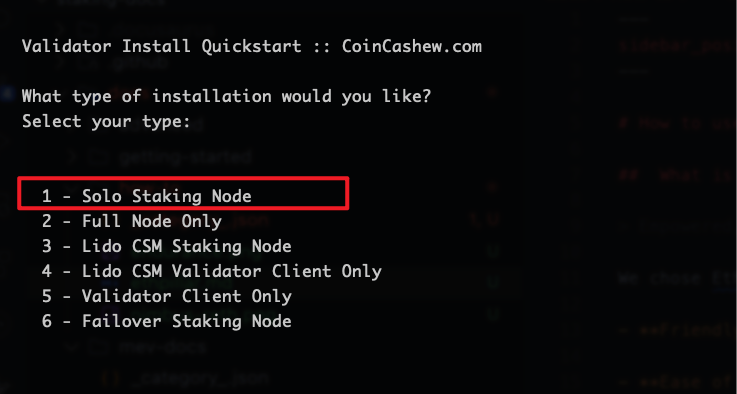

# How to Use EthPillar Setup Validator for Endurance Staking

## What is EthPillar?

> Empowered, inspired, home staker. Free. Open source. Public goods for Ethereum. Supports ARM64 and AMD64 architectures.

EthPillar is designed to streamline the onboarding process for new users aiming to become solo stakers. Here’s why we chose EthPillar:

- **User-Friendly Node Installer**: Deploy a systemd installation with minority clients `Nimbus-Reth` in mere minutes, including MEVboost.
- **Simplicity**: No need to memorize CLI commands. Access common node operations through a straightforward text user interface (TUI).
- **Swift Updates**: Easily find and download the latest consensus/execution releases, minimizing downtime.

## Installation

To install EthPillar, run the following command:

```sh
/bin/bash -c "$(curl -fsSL https://raw.githubusercontent.com/OpenFusionist/EthPillar-Endurance/main/install.sh)"
```

## Running Nodes

To start running nodes, simply execute:

```sh
ethpillar
```

EthPillar’s TUI provides comprehensive step-by-step instructions. Additionally, we have recorded a video guide for your convenience. *(TODO: add video link)*

Here are some screenshots of key steps:

- Selecting the Nimbus-Reth client (requires 4 CPU + 8G memory)

  

- Choosing the Endurance network

  

- Opting for solo-staking mode

  

## Generate Validator Key & Send Deposit

EthPillar integrates with [ethstaker-deposit-cli](https://github.com/OpenFusionist/ethstaker-deposit-cli) to assist users in managing Validators within the TUI. This includes generating and importing Validator keys, as well as making deposits.

To proceed, run `ethpillar`, select `Validator Client -> Generate / Import Validator Keys`, and follow the instructions. EthPillar will automatically load the generated keys into the validator.

Following the TUI prompts, you can choose to send your deposit request on-chain via [launchpad](https://staking.fusionist.io) (recommended for most users).

For advanced users who need to manage multiple keys simultaneously, we provide a batch sending [tool](https://github.com/OpenFusionist/staking-batch-depositer).

## Withdraw Deposit

EthPillar integrates with [ethdo](https://github.com/wealdtech/ethdo) to facilitate the withdrawal process for Validators within the TUI.

To withdraw, run `ethpillar`, select `Validator Client -> Generate Voluntary Exit Messages (VEM)` and `Validator Client -> Broadcast Voluntary Exit Messages (VEM)`, and follow the instructions.

:::note
EthPillar will withdraw all keys located in your specified validator keys folder.
:::
